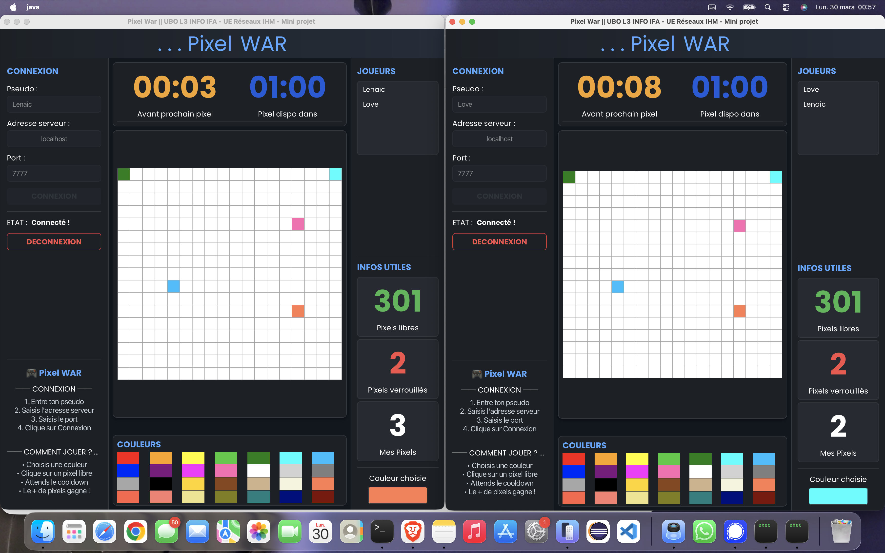

# 🎮 Pixel WAR - Jeu de coloriage de pixels en réseau

  

Application multijoueur de coloriage de pixels en temps réel, développée en Java avec JavaFX et une architecture client-serveur TCP.

---

## 📌 Description

Pixel WAR est un jeu réseau où plusieurs joueurs connectés au même serveur s'affrontent pour colorier un maximum de pixels sur une grille partagée. Chaque pixel colorié est verrouillé pendant **1 minute** avant de pouvoir être recolorié par un autre joueur. Le joueur ayant le plus de pixels gagne !

---

## 🧩 Architecture

```
┌─────────────────────────────────────┐
│            Client (Main.java)        │  ← Interface JavaFX + connexion TCP
│         Controller.java              │  ← Logique IHM et réception des messages
│         Client.java                  │  ← Gestion du socket client
└──────────────────┬──────────────────┘
                   │ TCP (ObjectStream)
┌──────────────────▼──────────────────┐
│            Serveur.java              │  ← Accepte les connexions
│            ClientSocket.java         │  ← Thread par client
│            Grille.java               │  ← État partagé de la grille
└─────────────────────────────────────┘
```

---

## 📁 Structure du projet

```
PixelWAR/
├── src/application/
│   ├── Main.java                  # Point d'entrée JavaFX
│   ├── Controller.java            # Contrôleur IHM
│   ├── Client.java                # Gestion socket côté client
│   ├── ClientSocket.java          # Thread par client côté serveur
│   ├── Serveur.java               # Serveur TCP multi-clients
│   ├── Grille.java                # Grille partagée côté serveur
│   ├── Pixel.java                 # Objet pixel sérialisable
│   ├── Request.java               # Objet requête sérialisable
│   ├── RequestType.java           # Enum des types de requêtes
│   ├── PixelVerrouilleException.java  # Exception pixel sous embargo
│   ├── CooldownException.java     # Exception cooldown joueur
│   ├── inter_mini_prj.fxml        # Interface JavaFX
│   └── pixelwar.css               # Feuille de style dark
├── Mini Projet.pdf                # Sujet du projet
└── exe-interface.png              # Capture d'écran de l'interface
```

---

## ⚙️ Stack technique

- **Langage** : Java
- **Interface** : JavaFX
- **Communication** : TCP (ObjectInputStream / ObjectOutputStream)
- **Sérialisation** : Java Serializable
- **OS** : macOS / Linux / Windows

---

## 🧠 Fonctionnalités

### 🔌 Connexion
- Saisie du pseudo, adresse serveur et port
- Vérification pseudo non déjà utilisé
- Champs désactivés après connexion
- Détection automatique si le serveur est injoignable

### 🎨 Jeu
- Grille 18×17 pixels partagée en temps réel
- 28 couleurs disponibles
- Clic sur un pixel libre → pose de la couleur
- Cooldown de **30 secondes** entre deux pixels
- Embargo de **1 minute** par pixel posé
- Clic sur un pixel verrouillé → affiche son temps restant

### 📊 Informations en temps réel
- Nombre de pixels libres / verrouillés
- Mes Pixels (score personnel)
- Timer cooldown (orange) - avant prochain pixel
- Timer embargo (bleu) - temps restant du pixel sélectionné
- Liste des joueurs connectés

### 🔔 Gestion des erreurs
- Champs vides → popup d'erreur
- Port invalide → popup d'erreur
- Pseudo déjà pris → popup d'erreur
- Serveur injoignable → popup + réactivation des champs

---

## 🚀 Lancement

### Prérequis
- Java 17+
- JavaFX SDK

### Lancer le serveur
```bash
java --enable-native-access=ALL-UNNAMED \
     --module-path /chemin/vers/javafx-sdk/lib \
     --add-modules javafx.controls,javafx.fxml \
     -cp bin application.Serveur 7777
```

### Lancer le client
```bash
java --enable-native-access=ALL-UNNAMED \
     --module-path /chemin/vers/javafx-sdk/lib \
     --add-modules javafx.controls,javafx.fxml \
     -cp bin application.Main
```

---

## 📸 Aperçu



---

## 👥 Équipe

Projet réalisé en **binôme** dans le cadre de l'UE Réseaux IHM - Licence 3 Informatique, Université de Bretagne Occidentale, 2025-2026.

---

## 👨‍💻 Auteur

**Lenaïc Love HOUNLEBA**

CEO & Développeur Full Stack - [ComeUp](https://comeup.com/fr/@lenaic-1)

🔗 [github.com/lenaic-hounleba](https://github.com/lenaic-hounleba)

📧 lovehounleba@gmail.com

---

*Projet réalisé dans le cadre de l'EC Réseaux IHM - Licence 3 Informatique, Université de Bretagne Occidentale, 2025-2026.*
